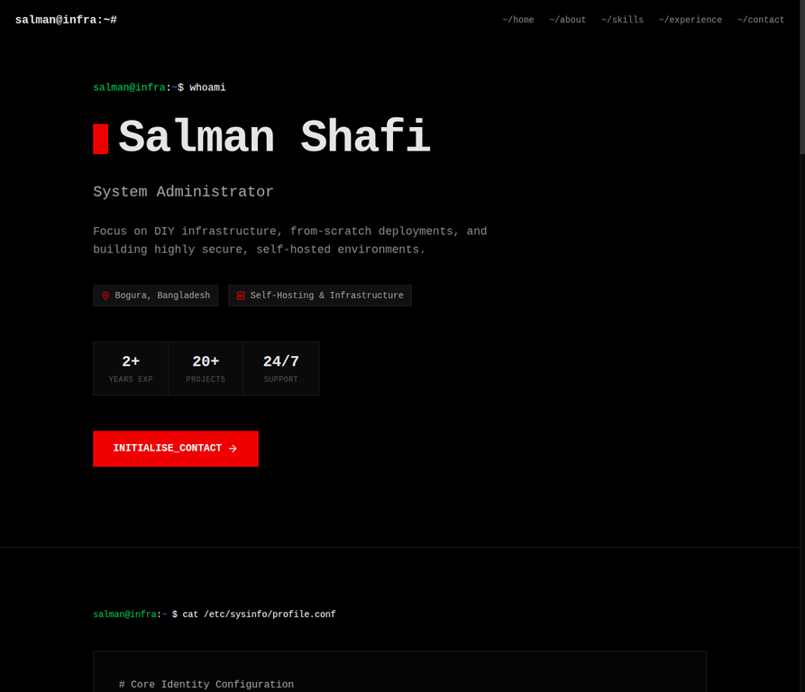

# 🖥️ Sysadmin Terminal Portfolio



A strict, terminal-driven portfolio website engineered for System Administrators, DevOps practitioners, and backend engineers. Built with **Astro 5**, it features a pure AMOLED `#000` interface, mechanical Framer Motion animations, and a fully functional CLI-styled contact execution sequence.

---

## 🚀 Core Infrastructure

### 🎨 Architecture & UI

| Layer | Specification |
|---|---|
| Environment | Pure AMOLED Black (`#000`) with syntax-highlighted accents |
| Typography | Strict monospace (`JetBrains Mono`) |
| Animations | Mechanical step-rendering & CSS glitch effects |
| Layout | `systemd` unit mimics, raw CLI outputs, and config blocks |
| Responsive | Fluid mobile-first adaptation with safe-area spacing |

### 📧 Contact Execution Sequence

| Component | Detail |
|---|---|
| Interface | Raw CLI parameter input form (`--name=`, `--email=`) |
| Security | Cloudflare Turnstile CAPTCHA integration (Runtime dynamic) |
| Transport | Nodemailer over secure SMTP |
| UX | Live terminal status output (`[ EXECUTING... ]`, `[ ERR ]`) |

### 🔍 SEO & Optimisation

* OpenGraph & Twitter Card meta tags
* JSON-LD structured data
* Dynamic sitemap generation at `/sitemap.xml`
* Included `robots.txt`
* Hyper-optimised payload (~99.7 kB first load JS)

---

## 🛠️ Tech Stack

| Domain | Technology |
|---|---|
| Framework | Astro 5 (server output) |
| Language | TypeScript |
| Styling | Tailwind CSS |
| Motion | Framer Motion (Variants) |
| Email | Nodemailer |
| Runtime | Podman / Docker |

---

## 📦 Deployment Configuration

### 1️⃣ Install Podman Infrastructure

```bash
sudo dnf install podman podman-compose
```

### 2️⃣ Clone the Repository

```bash
git clone git@github.com:EliteSalman/Astro-Portfolio-Salman-Shafi.git
cd Astro-Portfolio-Salman-Shafi
```

### 3️⃣ Environmental Variables

Create `.env.local` in the root directory prior to building the container. All variables must be set at build time.

```env
# SMTP Configuration
SMTP_HOST=host.example.tld
SMTP_USERNAME=your-smtp-username
SMTP_PASSWORD=your-smtp-password
SMTP_PORT=587
SMTP_SECURE=false

# Email Configuration
FROM_EMAIL_NAME=Your Name
FROM_EMAIL=no-reply@example.tld
TO_EMAIL=your-email@example.tld

# Application Configuration
NEXT_PUBLIC_SITE_URL=[https://example.tld](https://example.tld)

# Cloudflare Turnstile Configuration
TURNSTILE_SITE_KEY=your-turnstile-site-key
TURNSTILE_SECRET_KEY=your-turnstile-secret-key
```

### 4️⃣ Build the Container Image

```bash
podman build -t astro-portfolio .
```

### 5️⃣ Execute Podman Compose

```bash
podman-compose up -d
```

### 6️⃣ Verify Deployment

The application binds to port `4321` in the Astro Node server configuration. It is highly recommended to place this behind a reverse proxy (e.g., Caddy or NGINX) for production SSL termination rather than exposing the Node server directly.

```bash
curl -I http://127.0.0.1:4321
```

---

## 📂 Directory Structure

```text
.
├── src/
│   ├── pages/
│   │   ├── api/
│   │   │   ├── contact/
│   │   │   └── turnstile/
│   │   ├── layouts/Layout.astro
│   │   ├── styles/global.css
│   │   ├── index.astro
│   │   ├── sitemap.xml.ts
│   │   └── ...
│   └── components/
│       ├── home/
│       │   ├── Hero.tsx
│       │   ├── About.tsx
│       │   ├── Skills.tsx
│       │   ├── Experience.tsx
│       │   └── Contact.tsx
│       ├── Header.tsx
│       └── Footer.tsx
└── public/
    ├── photo.webp
    ├── share.webp
    └── ...
```

---

## 📞 Contact & Support

If you found this project helpful, consider giving it a ⭐ on GitHub.

* 📧 **Email** — [hello@salmanshafi.net](mailto:hello@salmanshafi.net)
* 🐛 **Issues** — [GitHub Issues](https://github.com/EliteSalman/Astro-Portfolio-Salman-Shafi/issues)
* 💬 **Discussions** — [GitHub Discussions](https://github.com/EliteSalman/Astro-Portfolio-Salman-Shafi/discussions)

---

## 👤 Original Project

This repository is a heavily modified fork of the original work by:

* **Author** — Mehedi Hasan
* **Email** — [hello@mehedims.com](mailto:hello@mehedims.com)
* **GitHub** — [asma019](https://github.com/asma019)
* **Repository** — [Astro-Portfolio-Salman-Shafi](https://github.com/EliteSalman/Astro-Portfolio-Salman-Shafi)

---

## 📄 Licence

Released under the [MIT Licence](LICENSE).
